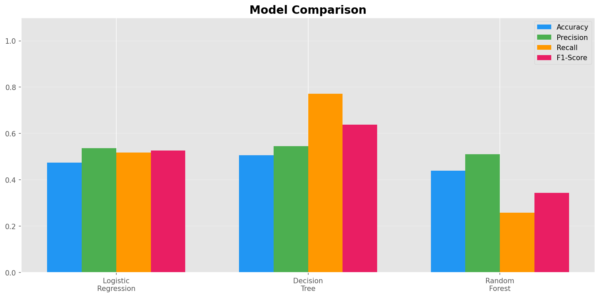
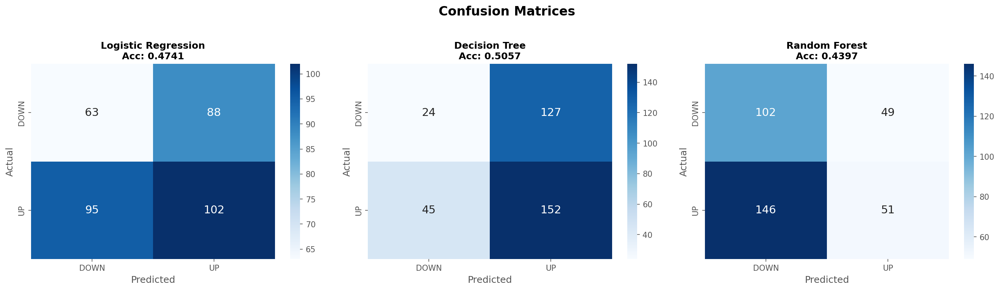
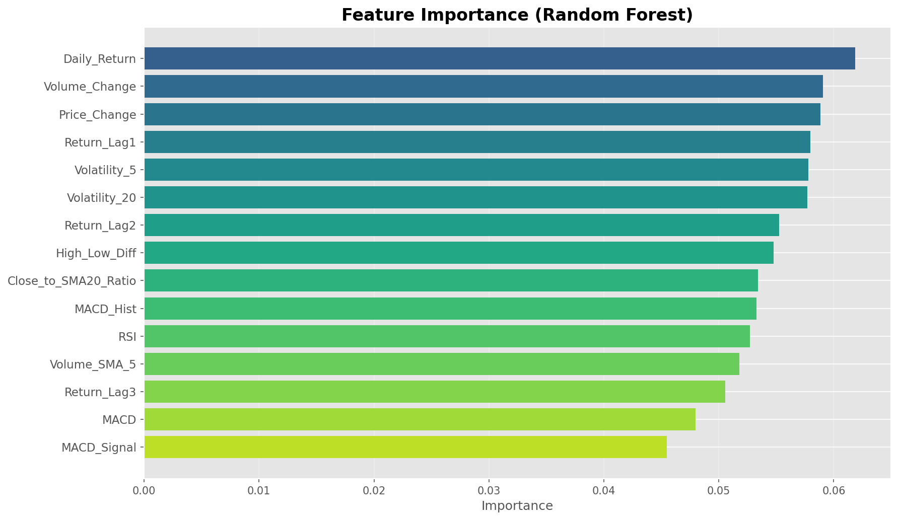

# 📈 Stock Market Trend Prediction Using Machine Learning

A web application that predicts whether a stock's next-day closing price will go **UP** or **DOWN** using Machine Learning.

## 🔗 Live Demo

**[Click Here to Try the App](https://stock-prediction-ml-sjni.onrender.com/)**

> First load may take 30-60 seconds. After that it works fast.

---

## 👥 Team Members

| Name | Role |
|------|------|
| **Yash Verma** | ML Engineer & Backend Developer |
| **Vishu Tarar** | Data Analyst & Researcher |
| **Daksh Chaudhary** | Frontend Developer & Deployment |

---

## 🤖 Acknowledgement

This project was developed with the assistance of AI tools such as ChatGPT and Claude for guidance, debugging, and code improvement.

AI was used as a support tool to enhance development efficiency, while the overall project structure, implementation, and understanding were developed through independent effort.

---

## 📌 About the Project

- Predicts next-day stock trend (UP or DOWN)
- Uses real-time stock data from Yahoo Finance
- Trained 3 ML models and compared their performance
- Deployed as a live web application

---

## 🤖 Models Used

| Model | Description |
|-------|-------------|
| **Random Forest** | Ensemble of 200 decision trees (Best performer) |
| **Logistic Regression** | Linear classifier using sigmoid function |
| **Decision Tree** | If-else rule based classifier |

---

## 📊 Features Used

- Simple Moving Averages (SMA 5, 10, 20)
- Exponential Moving Averages (EMA 12, 26)
- RSI (Relative Strength Index)
- MACD (Moving Average Convergence Divergence)
- Daily Return and Volume Change
- Price Volatility
- Lag Features (previous 1-3 days returns)
- Total 20+ technical indicators

---

## 🛠️ Technologies

- **Python** — Programming Language
- **Scikit-learn** — Machine Learning Models
- **Pandas & NumPy** — Data Processing
- **Streamlit** — Web Application
- **Yahoo Finance API** — Stock Data
- **Render** — Cloud Deployment

---


---

## ⚙️ How It Works

1. User enters a stock ticker (e.g., AAPL, MSFT)
2. System downloads latest data from Yahoo Finance
3. Computes 20+ technical indicators
4. Pre-trained ML model analyzes the data
5. Outputs prediction: **UP ▲** or **DOWN ▼** with confidence score

---

## 📊 Training Results







---

## 🖥️ Run Locally

```bash
# Clone the repository
git clone https://github.com/YOUR-USERNAME/stock-prediction-ml.git

# Go to project folder
cd stock-prediction-ml

# Install dependencies
pip install -r requirements.txt

# Run the app
streamlit run app.py


⚠️ Disclaimer
This project is for academic purposes only. Stock markets are unpredictable. Do NOT use this for real trading decisions.

📜 License
This project is created for educational purposes as a college mini project.
